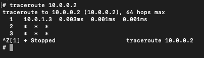
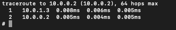
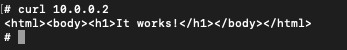

### 1. build httpd image `docker build . -t nhttpd`

### 2. create two containers of this image

    - `docker run --name s1 -d nhttpd  `
    - `docker run --name s2 -d nhttpd`  

### 3. create two custom networks

    - `docker network create backend`
    - `docker network create frontend`

### 4. attach each one to its network

    -   `docker network connect backend s1`
    -   `docker network connect frontend s2`

- both containers can't communicate with each other

### 5. create a gateway/router container

    - `docker run --name gw --network backend -d nhttpd  `  
    - attach it to frontend as well `docker network connect frontend gw`

- currently when we bash to gw `docker exec -it gw  sh ` we can ping s1 & s2 but s1 can't ping s2 and vice versa

### 6. forward packets to gw

    -  run container with network admin rights `docker run --name s1 --network backend --cap-add=NET_ADMIN -d nhttpd `    
    -   `docker run --name s2 --network frontend --cap-add=NET_ADMIN -d nhttpd `    
    - bash s2 `docker exec -it s2 sh` and `ip route add 10.0.0.0/24 via 10.0.1.3 `

- 10.0.0.2 is s1, 10.0.1.2 is s2
- for gw perform `nslookup gw` in both containers to know the gw ip
- execute  `traceroute 10.0.0.2`in s2
- currently s2 can send packets to s1 but s1 can't respond 
    - let's apply the route to s1 too. bash s1 `docker exec -it s1 sh` and `ip route add 10.0.1.0/24 via 10.0.0.3 `
- 
- 